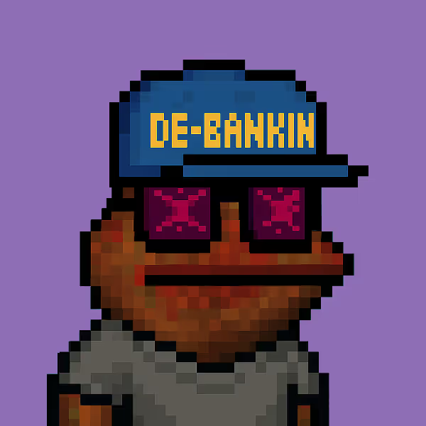

# 📚⚡ Study — HermesBro's Free Tutor

**The only free product in the HermesBro ecosystem. For everyone.**

Study is an open-source (MIT) AI tutor powered by three personas: Feynman's radical simplicity, Montessori's structured method, and Socrates' relentless questions. Free. Forever. For any student, in any country.

---

## Why Study

- 🧠 **Explanations that stick**: Feynman method — if you can't explain it to an 8-year-old, you haven't understood it
- 📋 **Custom study plans**: spaced repetition, active recall, 25-minute micro-goals
- 🎤 **Exam simulations**: oral exam practice with structured feedback on fluency, connections, accuracy
- 🔗 **Cross-disciplinary connections**: because exams reward those who weave subjects together, not list them
- 📖 **Speech revision**: upload your exam speech PDF and Study analyzes, corrects, rewrites weak sections

---

## Quick Start (2 minutes)

### Prerequisites

1. **Hermes Agent** installed → [Guide](https://hermes-agent.nousresearch.com/docs)
2. **DeepSeek API key** → [deepseek.com](https://platform.deepseek.com/api_keys) (free, ~$3-5/month with moderate use)
3. A terminal (or PowerShell on Windows)

### Install

```bash
# Clone the repo
git clone https://github.com/bonaventuratommasosam-bot/study.git
cd study

# Run the setup script
# Linux/Mac/WSL:
bash setup.sh

# Windows:
python setup.py
```

Answer 6 questions and Study comes alive.

### First run

```bash
hermes profile use study
hermes chat
```

Then type: *"Hey Study, I need to prepare for my exam. I have 30 days."*

---

## Channels

| Channel | How to activate |
|---------|-----------------|
| 💻 **CLI / Web** | Default — `hermes chat` from your terminal |
| 📱 **Telegram** | Create a bot via @BotFather, paste the token during setup |

---

## Supported Countries & Exams

| Country | Exam | Tracks |
|---------|------|--------|
| 🇮🇹 **Italy** | Maturità | Artistico, Classico, Scientifico, Scienze Umane, Tecnici |
| 🇺🇸 **USA** | SAT / AP | College Prep, AP Sciences, AP Humanities |
| 🇫🇷 **France** | Baccalauréat | Scientifique, SES/HGGSP, HLP/LLCER, Arts |
| 🇬🇧 **UK** | A-Levels / GCSE | Sciences, Humanities, Mixed, GCSE |
| 🇩🇪 **Germany** | Abitur | Naturwissenschaften, Sprachen, Gesellschaftswiss. |
| 🇪🇸 **Spain** | EBAU | Ciencias, Humanidades/CCSS, Artes |
| 🇵🇱 **Poland** | Matura | Liceum, Technikum |
| 🇭🇺 **Hungary** | Érettségi | Gimnázium, Szakközépiskola |
| 🌍 **More** | — | Austria, Switzerland, Netherlands, Sweden, Brazil, Argentina, Japan, Korea, India, China |

[Full syllabi →](profile/skills/education/study-tutoring/references/subject-syllabi.md)
[Add your country →](CONTRIBUTING.md)

---

## How It Works

Study is a **Hermes profile** — a pre-configured AI "brain" with a precise personality and battle-tested teaching method.

```
study/
├── profile/
│   ├── SOUL.md          ← The personality (Feynman + Montessori + Socrates)
│   ├── GOAL.md          ← The operating system (inbound, outbound, rules)
│   ├── config.yaml      ← Technical config (template)
│   └── skills/
│       └── study-tutoring/
│           ├── SKILL.md              ← Tutor workflow (8 phases)
│           └── references/
│               ├── subject-syllabi.md           ← Country-by-country programs
│               ├── fisica-feynman-artistico.md  ← Ready-to-use physics explanations
│               └── collegamenti-multidisciplinari.md
├── setup.sh             ← Setup script (Linux/Mac)
├── setup.py             ← Setup script (Windows)
└── docs/
```

### The Three Souls of Study

- **Richard Feynman** — "If you can't explain it to your grandmother, you don't understand it." Every concept starts with a concrete analogy. The formula comes after.
- **Maria Montessori** — "Help me do it myself." Structure, mind maps, micro-goals. Never the answer before you've tried.
- **Socrates** — "I know that I know nothing." Relentless questions until you reach the truth yourself. Zero superficial answers.

---

## Costs

| Item | Cost |
|------|------|
| Hermes Agent | Free (open source) |
| DeepSeek API | ~$0.50 / million tokens |
| Typical student usage | **$3-5 / month** |
| Telegram bot | Free |

---

## 🔗 On-Chain Digital Identity

Study isn't just code — it has a verifiable digital identity on the blockchain.

<p align="center">
  
</p>

**Study #4550** is an NFT from the [GRiBBiTS](https://opensea.io/collection/gribbits) collection on Base chain. A pixel-art frog with a "De-Banking" hat, purple shades, and a grey t-shirt — 0.53% rarity in the collection.

| Detail | Value |
|--------|-------|
| **Collection** | [GRiBBiTS](https://opensea.io/collection/gribbits) (verified) |
| **Chain** | Base (ERC-721) |
| **Token ID** | #4550 |
| **Owner** | [NonDigitalArtist](https://opensea.io/NonDigitalArtist) |
| **Rarity** | #833 out of 4,700+ |
| **Rare traits** | De-Banking Hat (0.53%), Grey T-Shirt (1%), Purple Shades (9%) |

[View on OpenSea →](https://opensea.io/item/base/0x38b7446dd746a98a101ec0bf1a0717784c4dc69f/4550)

### Why an NFT as identity?

Because Study is the first **free and open-source** AI agent with a verifiable on-chain identity. Not a stock logo. Not a generic icon. A unique piece on the blockchain — just like Study in the HermesBro ecosystem.

- **Verifiable**: anyone can check ownership on Base
- **Immutable**: Study's identity cannot be copied or forged
- **Symbolic**: a frog — an animal that observes, adapts, survives. Just like a student.

---

## Contributing

Study is open source (MIT). You can:

- 🏫 **Add a country** → [CONTRIBUTING.md](CONTRIBUTING.md)
- 🎨 **Write Feynman explanations** for new subjects
- 🐛 **Report bugs** or improvements
- 🌍 **Translate** into more languages

---

## Credits

Created by [Tommy](https://github.com/hermesbro) — art high school student, chef, builder.
Based on [Hermes Agent](https://github.com/nous-research/hermes-agent) by Nous Research.

---

## License

MIT — use it, modify it, share it. Education belongs to everyone.

---

*📚⚡ Suit up. Let's study.*
